```mermaid
flowchart TB
    subgraph upstream["Dependants (4)"]
        P2["<b>📦&nbsp;Example.Api.Adapters.Rest.csproj</b><br/><small>net9.0</small>"]
        P3["<b>📦&nbsp;Example.Api.Core.csproj</b><br/><small>net9.0</small>"]
        P4["<b>📦&nbsp;Example.Api.Adapters.Mongo.csproj</b><br/><small>net9.0</small>"]
        P5["<b>📦&nbsp;Example.Api.Web.csproj</b><br/><small>net9.0</small>"]
        click P2 "#restexampleapiadaptersrestcsproj"
        click P3 "#coreexampleapicorecsproj"
        click P4 "#dbexampleapiadaptersmongocsproj"
        click P5 "#webexampleapiwebcsproj"
    end
    subgraph current["Example.Api.Abstractions.csproj"]
        MAIN["<b>📦&nbsp;Example.Api.Abstractions.csproj</b><br/><small>net9.0</small>"]
        click MAIN "#abstractionsexampleapiabstractionscsproj"
    end
    P2 --> MAIN
    P3 --> MAIN
    P4 --> MAIN
    P5 --> MAIN

```

```mermaid
flowchart TB
    subgraph upstream["Dependants (1)"]
        P5["<b>📦&nbsp;Example.Api.Web.csproj</b><br/><small>net9.0</small>"]
        click P5 "#webexampleapiwebcsproj"
    end
    subgraph current["Example.Api.Core.csproj"]
        MAIN["<b>📦&nbsp;Example.Api.Core.csproj</b><br/><small>net9.0</small>"]
        click MAIN "#coreexampleapicorecsproj"
    end
    subgraph downstream["Dependencies (1"]
        P1["<b>📦&nbsp;Example.Api.Abstractions.csproj</b><br/><small>net9.0</small>"]
        click P1 "#abstractionsexampleapiabstractionscsproj"
    end
    P5 --> MAIN
    MAIN --> P1

```

```mermaid
flowchart TB
    subgraph upstream["Dependants (1)"]
        P5["<b>📦&nbsp;Example.Api.Web.csproj</b><br/><small>net9.0</small>"]
        click P5 "#webexampleapiwebcsproj"
    end
    subgraph current["Example.Api.Adapters.Mongo.csproj"]
        MAIN["<b>📦&nbsp;Example.Api.Adapters.Mongo.csproj</b><br/><small>net9.0</small>"]
        click MAIN "#dbexampleapiadaptersmongocsproj"
    end
    subgraph downstream["Dependencies (1"]
        P1["<b>📦&nbsp;Example.Api.Abstractions.csproj</b><br/><small>net9.0</small>"]
        click P1 "#abstractionsexampleapiabstractionscsproj"
    end
    P5 --> MAIN
    MAIN --> P1

```

```mermaid
flowchart TB
    subgraph upstream["Dependants (1)"]
        P5["<b>📦&nbsp;Example.Api.Web.csproj</b><br/><small>net9.0</small>"]
        click P5 "#webexampleapiwebcsproj"
    end
    subgraph current["Example.Api.Adapters.Rest.csproj"]
        MAIN["<b>📦&nbsp;Example.Api.Adapters.Rest.csproj</b><br/><small>net9.0</small>"]
        click MAIN "#restexampleapiadaptersrestcsproj"
    end
    subgraph downstream["Dependencies (1"]
        P1["<b>📦&nbsp;Example.Api.Abstractions.csproj</b><br/><small>net9.0</small>"]
        click P1 "#abstractionsexampleapiabstractionscsproj"
    end
    P5 --> MAIN
    MAIN --> P1

```

```mermaid
flowchart TB
    subgraph current["Example.Api.Web.csproj"]
        MAIN["<b>📦&nbsp;Example.Api.Web.csproj</b><br/><small>net9.0</small>"]
        click MAIN "#webexampleapiwebcsproj"
    end
    subgraph downstream["Dependencies (4"]
        P1["<b>📦&nbsp;Example.Api.Abstractions.csproj</b><br/><small>net9.0</small>"]
        P2["<b>📦&nbsp;Example.Api.Adapters.Rest.csproj</b><br/><small>net9.0</small>"]
        P3["<b>📦&nbsp;Example.Api.Core.csproj</b><br/><small>net9.0</small>"]
        P4["<b>📦&nbsp;Example.Api.Adapters.Mongo.csproj</b><br/><small>net9.0</small>"]
        click P1 "#abstractionsexampleapiabstractionscsproj"
        click P2 "#restexampleapiadaptersrestcsproj"
        click P3 "#coreexampleapicorecsproj"
        click P4 "#dbexampleapiadaptersmongocsproj"
    end
    MAIN --> P1
    MAIN --> P2
    MAIN --> P3
    MAIN --> P4

```

# Projects and dependencies analysis

This document provides a comprehensive overview of the projects and their dependencies in the context of upgrading to .NETCoreApp,Version=v10.0.

## Table of Contents

- [Executive Summary](#executive-Summary)
  - [Highlevel Metrics](#highlevel-metrics)
  - [Projects Compatibility](#projects-compatibility)
  - [Package Compatibility](#package-compatibility)
  - [API Compatibility](#api-compatibility)
- [Aggregate NuGet packages details](#aggregate-nuget-packages-details)
- [Top API Migration Challenges](#top-api-migration-challenges)
  - [Technologies and Features](#technologies-and-features)
  - [Most Frequent API Issues](#most-frequent-api-issues)
- [Projects Relationship Graph](#projects-relationship-graph)
- [Project Details](#project-details)

  - [Abstractions\Example.Api.Abstractions.csproj](#abstractionsexampleapiabstractionscsproj)
  - [Core\Example.Api.Core.csproj](#coreexampleapicorecsproj)
  - [Db\Example.Api.Adapters.Mongo.csproj](#dbexampleapiadaptersmongocsproj)
  - [Rest\Example.Api.Adapters.Rest.csproj](#restexampleapiadaptersrestcsproj)
  - [Web\Example.Api.Web.csproj](#webexampleapiwebcsproj)

## Executive Summary

### Highlevel Metrics

| Metric | Count | Status |
| :--- | :---: | :--- |
| Total Projects | 5 | All require upgrade |
| Total NuGet Packages | 27 | 11 need upgrade |
| Total Code Files | 62 |  |
| Total Code Files with Incidents | 20 |  |
| Total Lines of Code | 4408 |  |
| Total Number of Issues | 183 |  |
| Estimated LOC to modify | 158+ | at least 3,6% of codebase |

### Projects Compatibility

| Project | Target Framework | Difficulty | Package Issues | API Issues | Est. LOC Impact | Description |
| :--- | :---: | :---: | :---: | :---: | :---: | :--- |
| [Abstractions\Example.Api.Abstractions.csproj](#abstractionsexampleapiabstractionscsproj) | net9.0 | 🟢 Low | 7 | 3 | 3+ | ClassLibrary, Sdk Style = True |
| [Core\Example.Api.Core.csproj](#coreexampleapicorecsproj) | net9.0 | 🟢 Low | 3 | 2 | 2+ | ClassLibrary, Sdk Style = True |
| [Db\Example.Api.Adapters.Mongo.csproj](#dbexampleapiadaptersmongocsproj) | net9.0 | 🟢 Low | 1 | 1 | 1+ | ClassLibrary, Sdk Style = True |
| [Rest\Example.Api.Adapters.Rest.csproj](#restexampleapiadaptersrestcsproj) | net9.0 | 🟢 Low | 6 | 150 | 150+ | ClassLibrary, Sdk Style = True |
| [Web\Example.Api.Web.csproj](#webexampleapiwebcsproj) | net9.0 | 🟢 Low | 3 | 2 | 2+ | AspNetCore, Sdk Style = True |

### Package Compatibility

| Status | Count | Percentage |
| :--- | :---: | :---: |
| ✅ Compatible | 16 | 59,3% |
| ⚠️ Incompatible | 2 | 7,4% |
| 🔄 Upgrade Recommended | 9 | 33,3% |
| ***Total NuGet Packages*** | ***27*** | ***100%*** |

### API Compatibility

| Category | Count | Impact |
| :--- | :---: | :--- |
| 🔴 Binary Incompatible | 12 | High - Require code changes |
| 🟡 Source Incompatible | 0 | Medium - Needs re-compilation and potential conflicting API error fixing |
| 🔵 Behavioral change | 146 | Low - Behavioral changes that may require testing at runtime |
| ✅ Compatible | 4045 |  |
| ***Total APIs Analyzed*** | ***4203*** |  |

## Aggregate NuGet packages details

| Package | Current Version | Suggested Version | Projects | Description |
| :--- | :---: | :---: | :--- | :--- |
| Elyspio.Utils.Telemetry | 1.0.0 |  | [Example.Api.Abstractions.csproj](#abstractionsexampleapiabstractionscsproj) | ✅Compatible |
| Elyspio.Utils.Telemetry.MongoDB | 1.0.0 |  | [Example.Api.Abstractions.csproj](#abstractionsexampleapiabstractionscsproj) | ✅Compatible |
| Mapster | 7.4.0 |  | [Example.Api.Abstractions.csproj](#abstractionsexampleapiabstractionscsproj) | ✅Compatible |
| Microsoft.AspNetCore.Mvc.Core | 2.2.5 |  | [Example.Api.Abstractions.csproj](#abstractionsexampleapiabstractionscsproj) | ⚠️NuGet package is deprecated |
| Microsoft.AspNetCore.Mvc.NewtonsoftJson | 8.0.6 | 10.0.3 | [Example.Api.Web.csproj](#webexampleapiwebcsproj) | NuGet package upgrade is recommended |
| Microsoft.Extensions.Configuration.Abstractions | 8.0.0 | 10.0.3 | [Example.Api.Abstractions.csproj](#abstractionsexampleapiabstractionscsproj) | NuGet package upgrade is recommended |
| Microsoft.Extensions.Configuration.Binder | 8.0.1 | 10.0.3 | [Example.Api.Adapters.Rest.csproj](#restexampleapiadaptersrestcsproj) [Example.Api.Web.csproj](#webexampleapiwebcsproj) | NuGet package upgrade is recommended |
| Microsoft.Extensions.DependencyInjection.Abstractions | 8.0.1 | 10.0.3 | [Example.Api.Abstractions.csproj](#abstractionsexampleapiabstractionscsproj) | NuGet package upgrade is recommended |
| Microsoft.Extensions.Http | 8.0.0 | 10.0.3 | [Example.Api.Adapters.Rest.csproj](#restexampleapiadaptersrestcsproj) | NuGet package upgrade is recommended |
| Microsoft.Extensions.Logging.Abstractions | 8.0.1 | 10.0.3 | [Example.Api.Abstractions.csproj](#abstractionsexampleapiabstractionscsproj) | NuGet package upgrade is recommended |
| Microsoft.Extensions.Logging.Configuration | 8.0.0 | 10.0.3 | [Example.Api.Core.csproj](#coreexampleapicorecsproj) | NuGet package upgrade is recommended |
| MongoDB.Bson | 2.26.0 |  | [Example.Api.Abstractions.csproj](#abstractionsexampleapiabstractionscsproj) | ✅Compatible |
| MongoDB.Driver | 2.26.0 |  | [Example.Api.Adapters.Mongo.csproj](#dbexampleapiadaptersmongocsproj) | ✅Compatible |
| Newtonsoft.Json | 13.0.3 | 13.0.4 | [Example.Api.Abstractions.csproj](#abstractionsexampleapiabstractionscsproj) [Example.Api.Adapters.Rest.csproj](#restexampleapiadaptersrestcsproj) | NuGet package upgrade is recommended |
| Polly | 8.4.0 |  | [Example.Api.Adapters.Rest.csproj](#restexampleapiadaptersrestcsproj) | ✅Compatible |
| Scrutor | 4.2.2 |  | [Example.Api.Abstractions.csproj](#abstractionsexampleapiabstractionscsproj) [Example.Api.Adapters.Rest.csproj](#restexampleapiadaptersrestcsproj) [Example.Api.Core.csproj](#coreexampleapicorecsproj) [Example.Api.Web.csproj](#webexampleapiwebcsproj) | ✅Compatible |
| Serilog | 4.0.0 |  | [Example.Api.Abstractions.csproj](#abstractionsexampleapiabstractionscsproj) [Example.Api.Adapters.Rest.csproj](#restexampleapiadaptersrestcsproj) | ✅Compatible |
| Serilog.AspNetCore | 8.0.1 |  | [Example.Api.Web.csproj](#webexampleapiwebcsproj) | ✅Compatible |
| Serilog.Extensions.Hosting | 8.0.0 |  | [Example.Api.Web.csproj](#webexampleapiwebcsproj) | ✅Compatible |
| Serilog.Sinks.Console | 6.0.0 |  | [Example.Api.Core.csproj](#coreexampleapicorecsproj) [Example.Api.Web.csproj](#webexampleapiwebcsproj) | ✅Compatible |
| Swashbuckle.AspNetCore | 6.6.2 |  | [Example.Api.Web.csproj](#webexampleapiwebcsproj) | ✅Compatible |
| Swashbuckle.AspNetCore.Annotations | 6.6.2 |  | [Example.Api.Web.csproj](#webexampleapiwebcsproj) | ✅Compatible |
| Swashbuckle.AspNetCore.Newtonsoft | 6.6.2 |  | [Example.Api.Web.csproj](#webexampleapiwebcsproj) | ✅Compatible |
| System.ComponentModel.Annotations | 5.0.0 |  | [Example.Api.Adapters.Rest.csproj](#restexampleapiadaptersrestcsproj) | NuGet package functionality is included with framework reference |
| System.IdentityModel.Tokens.Jwt | 7.6.2 |  | [Example.Api.Abstractions.csproj](#abstractionsexampleapiabstractionscsproj) | ⚠️NuGet package is deprecated |
| System.Net.Http | 4.3.4 |  | [Example.Api.Adapters.Rest.csproj](#restexampleapiadaptersrestcsproj) | NuGet package functionality is included with framework reference |
| System.Runtime.Caching | 8.0.0 | 10.0.3 | [Example.Api.Core.csproj](#coreexampleapicorecsproj) | NuGet package upgrade is recommended |

## Top API Migration Challenges

### Technologies and Features

| Technology | Issues | Percentage | Migration Path |
| :--- | :---: | :---: | :--- |
| IdentityModel & Claims-based Security | 9 | 5,7% | Windows Identity Foundation (WIF), SAML, and claims-based authentication APIs that have been replaced by modern identity libraries. WIF was the original identity framework for .NET Framework. Migrate to Microsoft.IdentityModel.* packages (modern identity stack). |

### Most Frequent API Issues

| API | Count | Percentage | Category |
| :--- | :---: | :---: | :--- |
| T:System.Net.Http.HttpContent | 88 | 55,7% | Behavioral Change |
| T:System.Uri | 39 | 24,7% | Behavioral Change |
| M:System.Uri.#ctor(System.String,System.UriKind) | 14 | 8,9% | Behavioral Change |
| T:System.IdentityModel.Tokens.Jwt.JwtSecurityToken | 4 | 2,5% | Binary Incompatible |
| T:Microsoft.Extensions.DependencyInjection.ServiceCollectionExtensions | 3 | 1,9% | Binary Incompatible |
| M:System.Net.Http.HttpContent.ReadAsStreamAsync | 3 | 1,9% | Behavioral Change |
| M:System.Diagnostics.ActivitySource.StartActivity(System.String,System.Diagnostics.ActivityKind) | 1 | 0,6% | Behavioral Change |
| M:System.Uri.#ctor(System.String) | 1 | 0,6% | Behavioral Change |
| M:System.IdentityModel.Tokens.Jwt.JwtSecurityTokenHandler.ValidateToken(System.String,Microsoft.IdentityModel.Tokens.TokenValidationParameters,Microsoft.IdentityModel.Tokens.SecurityToken@) | 1 | 0,6% | Binary Incompatible |
| T:System.IdentityModel.Tokens.Jwt.JwtSecurityTokenHandler | 1 | 0,6% | Binary Incompatible |
| M:System.IdentityModel.Tokens.Jwt.JwtSecurityTokenHandler.#ctor | 1 | 0,6% | Binary Incompatible |
| T:System.IdentityModel.Tokens.Jwt.JwtPayload | 1 | 0,6% | Binary Incompatible |
| P:System.IdentityModel.Tokens.Jwt.JwtSecurityToken.Payload | 1 | 0,6% | Binary Incompatible |

## Projects Relationship Graph

Legend:
📦 SDK-style project
⚙️ Classic project

## Project Details

### Abstractions\Example.Api.Abstractions.csproj

#### Project Info

- **Current Target Framework:** net9.0
- **Proposed Target Framework:** net10.0
- **SDK-style**: True
- **Project Kind:** ClassLibrary
- **Dependencies**: 0
- **Dependants**: 4
- **Number of Files**: 27
- **Number of Files with Incidents**: 5
- **Lines of Code**: 1054
- **Estimated LOC to modify**: 3+ (at least 0,3% of the project)

#### Dependency Graph

Legend:
📦 SDK-style project
⚙️ Classic project

### API Compatibility

| Category | Count | Impact |
| :--- | :---: | :--- |
| 🔴 Binary Incompatible | 2 | High - Require code changes |
| 🟡 Source Incompatible | 0 | Medium - Needs re-compilation and potential conflicting API error fixing |
| 🔵 Behavioral change | 1 | Low - Behavioral changes that may require testing at runtime |
| ✅ Compatible | 506 |  |
| ***Total APIs Analyzed*** | ***509*** |  |

#### Project Technologies and Features

| Technology | Issues | Percentage | Migration Path |
| :--- | :---: | :---: | :--- |
| IdentityModel & Claims-based Security | 2 | 66,7% | Windows Identity Foundation (WIF), SAML, and claims-based authentication APIs that have been replaced by modern identity libraries. WIF was the original identity framework for .NET Framework. Migrate to Microsoft.IdentityModel.* packages (modern identity stack). |

### Core\Example.Api.Core.csproj

#### Project Info

- **Current Target Framework:** net9.0
- **Proposed Target Framework:** net10.0
- **SDK-style**: True
- **Project Kind:** ClassLibrary
- **Dependencies**: 1
- **Dependants**: 1
- **Number of Files**: 5
- **Number of Files with Incidents**: 4
- **Lines of Code**: 227
- **Estimated LOC to modify**: 2+ (at least 0,9% of the project)

#### Dependency Graph

Legend:
📦 SDK-style project
⚙️ Classic project

### API Compatibility

| Category | Count | Impact |
| :--- | :---: | :--- |
| 🔴 Binary Incompatible | 2 | High - Require code changes |
| 🟡 Source Incompatible | 0 | Medium - Needs re-compilation and potential conflicting API error fixing |
| 🔵 Behavioral change | 0 | Low - Behavioral changes that may require testing at runtime |
| ✅ Compatible | 124 |  |
| ***Total APIs Analyzed*** | ***126*** |  |

#### Project Technologies and Features

| Technology | Issues | Percentage | Migration Path |
| :--- | :---: | :---: | :--- |
| IdentityModel & Claims-based Security | 1 | 50,0% | Windows Identity Foundation (WIF), SAML, and claims-based authentication APIs that have been replaced by modern identity libraries. WIF was the original identity framework for .NET Framework. Migrate to Microsoft.IdentityModel.* packages (modern identity stack). |

### Db\Example.Api.Adapters.Mongo.csproj

#### Project Info

- **Current Target Framework:** net9.0
- **Proposed Target Framework:** net10.0
- **SDK-style**: True
- **Project Kind:** ClassLibrary
- **Dependencies**: 1
- **Dependants**: 1
- **Number of Files**: 8
- **Number of Files with Incidents**: 3
- **Lines of Code**: 345
- **Estimated LOC to modify**: 1+ (at least 0,3% of the project)

#### Dependency Graph

Legend:
📦 SDK-style project
⚙️ Classic project

### API Compatibility

| Category | Count | Impact |
| :--- | :---: | :--- |
| 🔴 Binary Incompatible | 1 | High - Require code changes |
| 🟡 Source Incompatible | 0 | Medium - Needs re-compilation and potential conflicting API error fixing |
| 🔵 Behavioral change | 0 | Low - Behavioral changes that may require testing at runtime |
| ✅ Compatible | 398 |  |
| ***Total APIs Analyzed*** | ***399*** |  |

### Rest\Example.Api.Adapters.Rest.csproj

#### Project Info

- **Current Target Framework:** net9.0
- **Proposed Target Framework:** net10.0
- **SDK-style**: True
- **Project Kind:** ClassLibrary
- **Dependencies**: 1
- **Dependants**: 1
- **Number of Files**: 4
- **Number of Files with Incidents**: 5
- **Lines of Code**: 1936
- **Estimated LOC to modify**: 150+ (at least 7,7% of the project)

#### Dependency Graph

Legend:
📦 SDK-style project
⚙️ Classic project

### API Compatibility

| Category | Count | Impact |
| :--- | :---: | :--- |
| 🔴 Binary Incompatible | 5 | High - Require code changes |
| 🟡 Source Incompatible | 0 | Medium - Needs re-compilation and potential conflicting API error fixing |
| 🔵 Behavioral change | 145 | Low - Behavioral changes that may require testing at runtime |
| ✅ Compatible | 1972 |  |
| ***Total APIs Analyzed*** | ***2122*** |  |

#### Project Technologies and Features

| Technology | Issues | Percentage | Migration Path |
| :--- | :---: | :---: | :--- |
| IdentityModel & Claims-based Security | 4 | 2,7% | Windows Identity Foundation (WIF), SAML, and claims-based authentication APIs that have been replaced by modern identity libraries. WIF was the original identity framework for .NET Framework. Migrate to Microsoft.IdentityModel.* packages (modern identity stack). |

### Web\Example.Api.Web.csproj

#### Project Info

- **Current Target Framework:** net9.0
- **Proposed Target Framework:** net10.0
- **SDK-style**: True
- **Project Kind:** AspNetCore
- **Dependencies**: 4
- **Dependants**: 0
- **Number of Files**: 19
- **Number of Files with Incidents**: 3
- **Lines of Code**: 846
- **Estimated LOC to modify**: 2+ (at least 0,2% of the project)

#### Dependency Graph

Legend:
📦 SDK-style project
⚙️ Classic project

### API Compatibility

| Category | Count | Impact |
| :--- | :---: | :--- |
| 🔴 Binary Incompatible | 2 | High - Require code changes |
| 🟡 Source Incompatible | 0 | Medium - Needs re-compilation and potential conflicting API error fixing |
| 🔵 Behavioral change | 0 | Low - Behavioral changes that may require testing at runtime |
| ✅ Compatible | 1045 |  |
| ***Total APIs Analyzed*** | ***1047*** |  |

#### Project Technologies and Features

| Technology | Issues | Percentage | Migration Path |
| :--- | :---: | :---: | :--- |
| IdentityModel & Claims-based Security | 2 | 100,0% | Windows Identity Foundation (WIF), SAML, and claims-based authentication APIs that have been replaced by modern identity libraries. WIF was the original identity framework for .NET Framework. Migrate to Microsoft.IdentityModel.* packages (modern identity stack). |

