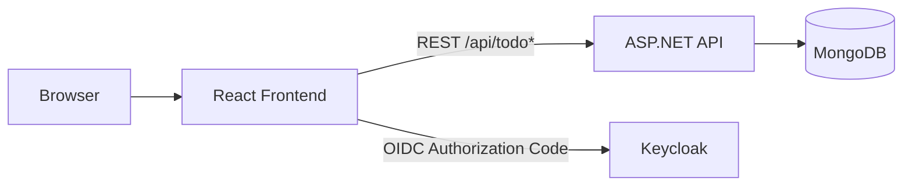

# React API Template

A modern full-stack template combining a React SPA, a .NET Web API, MongoDB persistence, and OIDC authentication.

This repository is designed to bootstrap a production-minded app quickly, with a strong local developer experience through .NET Aspire orchestration.

## Highlights

- React 19 + Vite + TypeScript frontend
- Material UI 7 design system with theme switching
- .NET 10 Web API (Swagger/OpenAPI enabled)
- MongoDB data layer
- OIDC login flow (Keycloak in local orchestrated setup)
- OpenTelemetry hooks via Aspire service defaults
- Generated TypeScript API client from backend Swagger

## Stack

| Layer | Tech |
|---|---|
| Frontend | React, Vite, TypeScript, Redux Toolkit, MUI, react-oidc-context |
| Backend | ASP.NET Core (.NET 10), Swagger/Swashbuckle, Serilog |
| Data | MongoDB |
| Auth | OIDC (Keycloak realm provided for local dev) |
| Orchestration | .NET Aspire AppHost |
| Build/Deploy | Docker Buildx + Docker Compose |

## Monorepo Structure

```text
.
|- Example.Front/          # React application
|  |- src/
|  |- public/conf.js       # Runtime frontend config (API + OIDC)
|  `- scripts/refresh-api.ts
|
|- Example.Api/
|  |- Example.Api.Web/                 # ASP.NET Core API
|  |- Example.Api.Core/                # Business services
|  |- Example.Api.Adapters.Mongo/      # Mongo repositories
|  |- Example.Api.Adapters.Rest/       # REST adapter module
|  `- Example.Api.Abstractions/        # Contracts/models/shared infrastructure
|
|- Example.AppHost/        # Aspire orchestrator (frontend + api + mongo + keycloak)
|
`- deploy/                 # Docker build/deployment assets
```

## Architecture



## Quick Start (Recommended)

Run the full local stack with Aspire (frontend + api + mongodb + keycloak):

```bash
aspire run 
```

What you get:

- Frontend served by Vite app resource
- API project started and wired to MongoDB
- Keycloak container preloaded with realm `react-api-template`
- Aspire dashboard for local observability

Local demo credentials (from `Example.AppHost/keycloak/react-api-template-realm.json`):

- Username: `demo`
- Password: `demo`

## Manual Development (Without Aspire)

### 1. Frontend

```bash
cd Example.Front
yarn install
yarn dev
```

### 2. Backend

The API expects `ConnectionStrings:MongoDB`.

```bash
dotnet run --project Example.Api/Example.Api.Web/Example.Api.Web.csproj
```

By default, launch settings expose HTTP on port `4000`.

If you run backend manually, ensure:

- a reachable MongoDB instance
- CORS origins are configured if frontend is on another origin (`Cors:AllowedOrigins`)

## Frontend Runtime Configuration

`Example.Front/public/conf.js` is loaded at runtime and provides fallback values:

- `window.example.config.endpoints.core`
- `window.example.config.oidc.*`

Supported Vite env overrides (`Example.Front/src/config/env.d.ts`):

- `VITE_API_BASE_URL`
- `VITE_OIDC_AUTHORITY`
- `VITE_OIDC_REALM`
- `VITE_OIDC_CLIENT_ID`
- `VITE_OIDC_SCOPE`
- `VITE_OIDC_REDIRECT_PATH`
- `VITE_OIDC_POST_LOGOUT_REDIRECT_PATH`
- `VITE_OIDC_SILENT_REDIRECT_PATH`

## API Endpoints

Main controllers:

- Public todos: `Example.Api/Example.Api.Web/Controllers/TodoController.cs`
- User-scoped todos: `Example.Api/Example.Api.Web/Controllers/TodoUserController.cs`

Routes:

- `GET /api/todo`
- `POST /api/todo`
- `PUT /api/todo/{id}/toggle`
- `DELETE /api/todo/{id}`
- `GET /api/todo/user`
- `POST /api/todo/user`
- `PUT /api/todo/user/{id}/toggle`
- `DELETE /api/todo/user/{id}`

Swagger UI is enabled on the API host.

## Generate/Refresh Frontend API Client

```bash
cd Example.Front
yarn refresh-api
```

The generator currently targets:

- `https://localhost:9851/swagger/v1/swagger.json`

If your backend runs on another URL/port, update `Example.Front/scripts/refresh-api.ts`.

## Frontend Scripts

From `Example.Front/`:

- `yarn dev` - start Vite dev server
- `yarn build` - typecheck + production build
- `yarn refresh-api` - regenerate OpenAPI client
- `yarn check:types` - TypeScript check only
- `yarn check:lint` - lint and auto-fix
- `yarn format` - format source files

## Production Build & Deployment

Docker build assets are under `deploy/build/`.

Build and push image (Buildx bake):

```bash
cd Example.Front
yarn docker
```

Deployment example (Traefik-oriented) is under:

- `deploy/environments/prod/docker-compose.yml`

Runtime overrides are mounted from:

- `deploy/environments/prod/config/front/conf.js`
- `deploy/environments/prod/config/back/appsettings.docker.json`

## Requirements

- .NET SDK 10 (preview-compatible, project targets `net10.0`)
- Node.js + Yarn Classic
- Docker (recommended for Aspire resources and production image workflows)

## Notes

- The entire app is protected by OIDC flow in the frontend router.
- Theme can be switched from the UI (light/dark).
- The repository is intended as a template: adjust naming, security defaults, and deployment specifics before production use.
